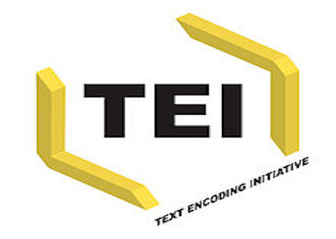
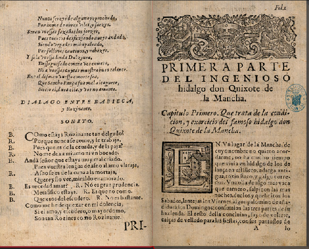
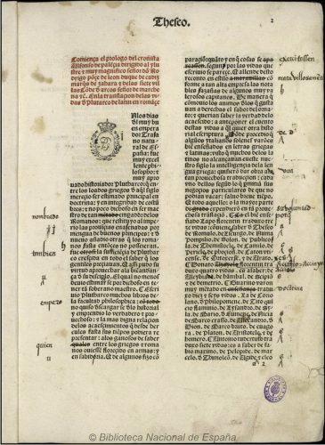
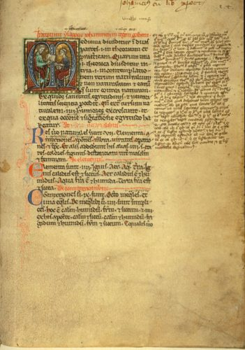
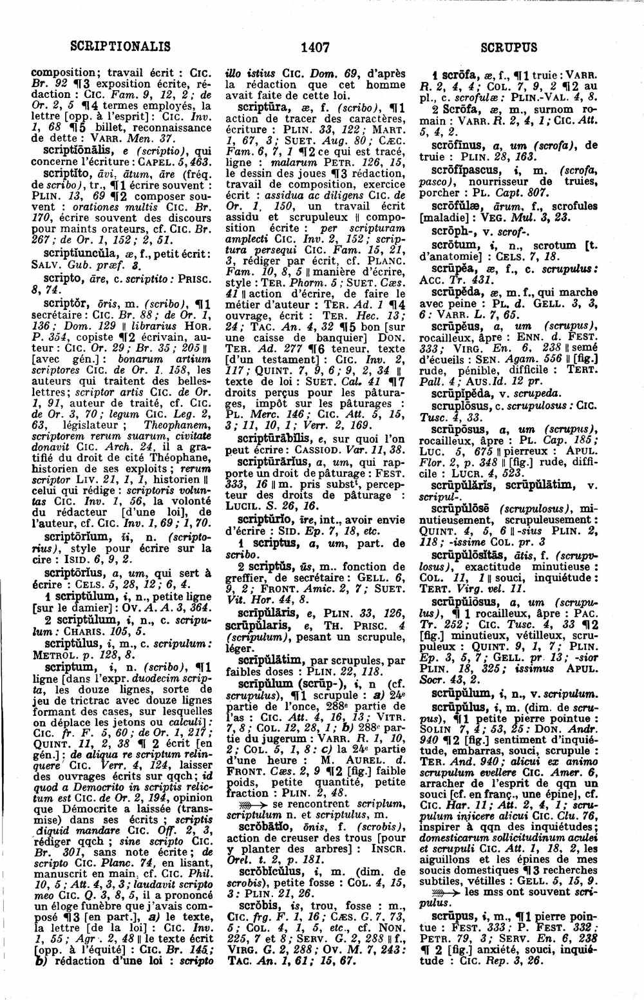
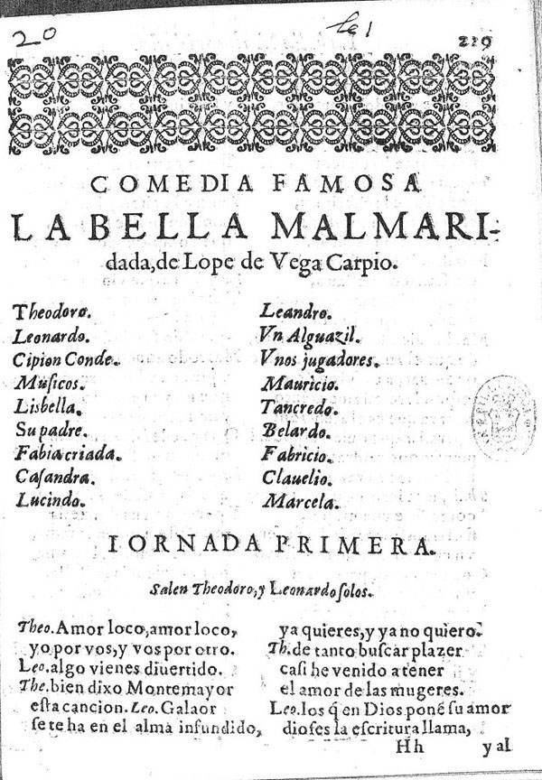

Esta lección es una primera aproximación a la Text Encoding Initiative, un marco de trabajo concebido especialmente para la codificación, la explotación informática, la publicación en línea y la preservación de textos en ciencias sociales y humanidades, utilizado internacionalmente y por una gran comunidad de usuarios. Trataremos conceptos como el marcado de textos, su utilidad y los campos de aplicación.

# I. Codificación, texto y TEI  

En el ámbito de las humanidades y las ciencias sociales, el texto representa, en la mayoría de los casos, el punto de partida de muchas investigaciones. La introducción de métodos y herramientas propios de la ciencia informática llevaron hace ya más de veinte años a replantearse la importancia del texto y su procesamiento informático. La gran cantidad de textos a nuestra disposición conlleva la adopción de nuevas estrategias para la creación, la explotación y su conservación.  

La iniciativa de marcado de textos nace pues de la necesidad de procesar los textos desde un punto de vista informático, para que, en definitiva, no sea susceptible solo de una lectura "plana", sino para que sea procesable a través de múltiples herramientas como pueden ser programas de concordancias, análisis estilométricos, gráficos de frecuencias, segmentación gramatical o, sobretodo, su publicación web y la posibilidad de realizar búsquedas inteligentes. 

La Text Encoding Initiative <http://www.tei-c.org/> fue la primera iniciativa científica destinada a la codificación informática de textos, actualmente es una de las más utilizadas y uno de los temas centrales en la disciplina de las humanidades digitales.  

# II. ¿Qué es TEI? 

La Text Encoding Initiative se ampara en primera instancia en el Consorcio TEI <http://www.tei-c.org/about/organization/>, cuya estructura veremos más abajo. Este consorcio compuesto por personas e instituciones es el responsable de desarrollar y mantener actualizadas las *Guías directrices* <http://www.tei-c.org/Guidelines/> para el marcado de los textos en formato digital. Estas guías son una especie de manual de codificación o de recomendaciones de buenas prácticas que especifican una metodología concreta de codificación de los textos de manera que sean leídos y procesados por las computadoras.  

TEI posee una plataforma web donde se publican tanto las Guías directrices como un sinfín de herramientas y de comunidades de ayuda. Aquí encontraréis una primera definición que nos será útil para empezar:    

>The *TEI Guidelines for Electronic Text Encoding and Interchange* define and document a markup language for representing the structural, renditional, and conceptual features of texts. They focus (though not exclusively) on the encoding of documents in the humanities and social sciences, and in particular on the representation of primary source materials for research and analysis. These guidelines are expressed as a modular, extensible XML schema, accompanied by detailed documentation, and are published under an open-source license. The Guidelines are maintained and developed by the TEI Consortium, through its Technical Council, with the support and participation of the TEI community.   

>"Las *Guías* *Directrices para la codificación y el intercambio de textos electrónicos* definen y documentan un lenguaje de marcado para la representación de las características estructurales, físicas y conceptuales de los textos. Su foco de atención es el marcado de documentos en Humanidades y Ciencias Sociales (aunque no exclusivamente), y en particular la representación de fuentes primarias para su explotación y análisis. Estas líneas directrices se expresan de forma modular, a través de esquemas XML extensibles, están acompañadas de una documentación detallada, y publicadas bajo una licencia en acceso abierto. Las *Guías* *Directrices* son mantenidas y desarrolladas por el Conaoexio TEI, a través de su Comité Técnico, con el respaldo y la participación de la comunidad TEI".                                                                                                                                               http://www.tei-c.org/Guidelines/  

Veamos paso por paso los diferentes puntos básicos de esta definición.  

1.  El núcleo central de la TEI son las *Guías Directrices* que constituyen el manual de uso y la recomendación de buenas prácticas sobre cómo proceder. Su misión principal es proponer unas pautas claras para el marcado y el intercambio electrónico de los textos y ofrecer una documentación general y explicativa.  
2.  Las *Guías Directrices* proponen un tipo concreto de lenguaje de marcado que consiste en aislar a través de "marcas" o "etiquetas" las características textuales, ya sean estructurales (como capítulos de libro, secciones, apartados, párrafos, estrofas, versos, etc.), como físicas (distribución de la página en columnas en un manuscrito), como conceptuales o semánticas (nombres de personas, de lugares, palabras clave, etc.).  
3.  TEI es especialmente usada en las disciplinas humanísticas, ciencias sociales o lingüística, y en la representación de las fuentes primarias, tales como manuscritos (de hecho, TEI es muy utilizada en las bibliotecas para la descripción y catalogación de sus fondos).  
4.  El sistema de marcado propuesto por TEI tiene una naturaleza modular que agrupa fenomenología diversa en un mismo "módulo". Tiene cuatro obligatorios, que corresponden a elementos compartidos por todos y cada uno de los documentos TEI (como puede ser el elemento raíz, o el elemento párrafo). Esta característica modular permite customizar o personalizar el modelo de marcado que cada proyecto necesita.  
5.  TEI se expresa a través del lenguaje estándar web XML, Extensible Markup Language o Lenguaje de Marcas Extensible, que veremos en detalle en el próximo tema Además, por lo general, los esquemas o modelos de marcado también utilizan este mismo lenguaje.  
6.  TEI ofrece una gran cantidad de documentación detallada sobre cada uno de los elementos, módulos y en general cualquier aspecto relacionado con su uso y buenas prácticas.  
7.  Todo este material es de acceso abierto, con lo cual se puede consultar libremente online, descargarse, reutilizarse e, incluso, ser susceptible de mejoras a través de la retroalimentación de los usuarios. Todo el material está disponible en [GitHub](https://github.com/TEIC/TEI).  

En lo que concierne a los objetivos de TEI, podríamos resumirlos de la siguiente manera:
  
* ofrecer unas guías directrices para la creación y la manipulación de todo tipo de datos textuales. Los datos pueden proceder de textos de cualquier naturaleza, manuscritos, documentos de archivos, inscripciones, correspondencia, novelas, obras dramáticas, etc.  
* promover la creación, el intercambio y la integración de los datos textuales informatizados.
* contemplar textos de cualquier tipología, género y disciplina (Ciencias Humanas y Sociales, Humanidades, Lingüística), en cualquier lengua y de cualquier periodo cronológico.
* captar tanto a un público novel, sin conocimientos previos en informática, que quiera codificar un material textual, como a un público técnico, capaz de buscar nuevas soluciones técnicas.  

Las ventajas que ofrece el uso de TEI son múltiples y entre ellas podemos señalar:  

* XML-TEI no depende de ningún software o programa informático y por tanto es gratuito e independiente. Un documento XML será siempre el mismo en cualquier sistema operativo o aplicación. Este hecho evita que se puedan dar situaciones catastróficas, en que, por ejemplo, un programa con un formato propietario ya no se mantenga o no se utilice y los documentos queden obsoletos.
* XML-TEI ha sido diseñado por y para la comunidad científica que es la encargada en última instancia de promover y mejorar las guías de marcado. Cuantos más usuarios y más gente implicada haya utilizando el mismo sistema de marcado, más se avanzará hacia una propuesta sólida de codificación.
* XML-TEI facilita el reuso en diferentes formatos, en diferentes contextos, por diferentes usuarios. Un marcado a través de un estándar web, independiente de cualquier software o plataforma web, permite y facilita la reutilización del mismo material: en diferentes formatos, en contextos diferentes, por diferentes usuarios. Ello permite que proyectos posteriores o contemporáneos puedan establecer un vínculo y un uso diferente del material publicado, evitando el tener que empezar de cero y avanzando en el conocimiento.
* XML-TEI se centra en el significado y el contenido del texto y no en su apariencia o en su presentación final (es decir, no es tan relevante el señalar un título en negrita, como definir que efectivamente se trata de un "título").  

# III. ¿Qué entendemos por texto?

Antes de adentrarnos en ejemplos concretos, conviene que reflexionemos por un momento sobre qué es un texto. Una pregunta tan sencilla y obvia esconde en realidad una respuesta compleja y no siempre fácil de definir.  

El texto es una idea abstracta que presupone la existencia de una secuencia de símbolos lingüísticos. ¿Pero donde se encuentra exactamente un texto? ¿Lo debemos buscar en el original que escribió el autor o en todas las otras copias y ediciones posteriores? ¿Lo debemos extraer de la historia que se explica o en las intenciones últimas del autor? ¿O es quizás en la presentación y distribución de la página?  

Centrémonos por un momento en los siguientes ejemplos e intentemos reflexionar sobre dónde está el texto:    

Cada una de estas tipologías contiene aspectos diferentes y todos en realidad tienen un texto. El diccionario contiene voces y significados; la obra teatral tiene escenas y personajes; una postal, además del mensaje, contiene información sobre quien y para quien se escribió; el manuscrito antiguo puede contener diversas obras, la edición del siglo XVI contiene un rico frontispicio con informaciones sobre la impresión, etc. Además hay otros aspectos que en realidad también forman parte del texto aunque sea desde un punto de vista físico: la estructura textual (parágrafos, listas, tablas...), en el caso del manuscrito vemos letras dañadas, caracteres especiales, líneas del folio, abreviaciones, anotaciones manuscritas, correcciones de autor, errores, y un sinfín de casuística.  

El texto, pues, no es solo el contenido textual sino que hay muchas otras variantes y componentes que debemos tener en cuenta a la hora de su codificación. Es importante que cuando afrontamos cualquier proyecto de marcado tengamos en cuenta todas y cada una de estas características que componen el "texto" en un sentido amplio. Por ello, será útil establecer una diferencia entre los conceptos de "texto" y "documento". Mientras que el documento corresponde a un objeto en el mundo real que podemos escanear o digitalizar, como podría ser el caso de estas imágenes. El texto, en cambio, corresponde a la idea abstracta del contenido de ese documento, creado por y para una comunidad de lectores. Es esta última acepción de "texto" con la que en realidad trabajamos la mayoría de las veces al editar o codificar y requiere un análisis previo así como un cierto nivel de abstracción.  

# IV. La codificación de un texto

Todas las informaciones que queramos localizar y reutilizar deben ser marcadas de una manera explícita y a través de unas marcas informáticas. Sólo las informaciones que son explícitas podrán ser buscadas a posteriori, procesadas y presentadas.

Un marcado electrónico es un valor añadido al texto pues puede proporcionar múltiples anotaciones, difícilmente señalables en una edición en papel, como por ejemplo en qué secuencia un autor canceló y añadió ciertas correcciones.  

Es importante antes de empezar a codificar saber qué elementos queremos aislar y cuáles son útiles para nuestro proyecto:  

* divisiones estructurales dentro del texto: título de la página, capítulo, escena, poema, línea, párrafo...  
* elementos tipográficos puntuales: cambios de letra, caracteres especiales...  
* informaciones semánticas: personas, lugares, eventos, fechas...  
* otros elementos: estructuras sintácticas, formas gramaticales, localización de ilustraciones, gráficos, tablas, imágenes...  

La decisión, una vez más, dependerá de las informaciones que queramos recuperar *a posteriori* y procesar informáticamente.  

# V. Formato vs Contenido 

Conviene aclarar antes de entrar en materia que existen diferentes tipos de lenguajes de marcado. Para simplificarlo, -y para lo que a nosotros aquí nos conviene- podemos establecer dos tipos básicos de lenguajes informáticos, por un lado, están los que se ocupan de la presentación (en inglés, "Presentational markup"), es decir, de cuestiones como los diferentes tipos de fuentes, el diseño y a la distribución en la página web, etc.; y por otro lado, los lenguajes descriptivos ("Descriptive markups") que se ocupan de señalar lo que son las cosas sin preocuparse de cómo aparecerán en la página web o sea cual sea su formato de salida; su transformación y presentación se relega a una etapa posterior.  

Un lenguaje de presentación es claramente el lenguaje HTML que se ocupa de presentar los contenidos en la web; por el contrario, el lenguaje XML es descriptivo pues se centra en el contenido semántico. Volvamos al ejemplo anterior: imaginemos que queremos marcar el título principal de una obra; pues bien, HTML lo marcaría de esta manera: `<b>Título</b>`, donde `<b>` está por "bold" o negrita; mientras que XML lo marcaría con otra etiqueta que indicara lo que es, no cómo debe aparecer: `<title type="principal">Título</title>`. El lenguaje XML-TEI, al centrarse en el contenido semántico y no en su presentación, no señala si una palabra irá o no en negrita, sino la naturaleza de ese elemento, en este caso un "título". De esta manera, el contenido nunca está limitado a la perspectiva de un único editor, el texto existe y la presentación que se obtenga al final es relativamente irrelevante. Además, como tendréis tiempo de ver, un documento XML puede ser transformado con facilidad a múltiples formatos, como .doc, epub, html, pdf, pero no siempre al revés.  

En definitiva, el hecho de separar la forma o su presentación de su contenido facilita la reutilización de un documento pues no contiene todavía los corsés del formato, de manera que su difusión y reciclaje es mucho más flexible.  

# VI. Historia de la Text Encoding Initiative

Hacia los años ochenta diferentes tecnologías ya habían entrado a formar parte de ciertos campos de las humanidades y las ciencias sociales; recordemos por ejemplo que la lingüística de corpus ya había visto aparecer diferentes iniciativas de proyectos lexicográficos a gran escala, como el *Index Thomisticus* del padre Roberto Busa <https://en.wikipedia.org/wiki/Roberto_Busa> que contó con la colaboración de IBM. 

El reto que se planteó entonces fue el de desarrollar, mantener y publicar un método de codificación para los datos en humanidades en un formato electrónico que fuera independiente tanto de *hardware* y sistemas operativos como de programas informáticos. Ante el crecimiento de sistemas diferentes de representación de materiales textuales, incluidos procesadores de texto, urgía la necesidad de ofrecer a la comunidad científica un método sólido para alargar la vida de sus datos y poder reutilizarlos en el futuro con objetivos diferentes. El hecho de que cada compañía ofreciera un programa y formatos propietarios entorpecía el trabajo académico y hacía difícil la planificación de proyectos de larga escala y duración.

Así pues, en 1987 tuvo lugar la primera reunión en el Vassar College (Poughkeepsie, NY), financiada por la [*Association for Computers in the Humanities*](http://ach.org/) y el [*National Endowment for the Humanities*](https://www.neh.gov/), con el fin de crear unas guías directrices para la codificación de textos electrónicos. El texto que de ahí salió se puede consultar todavía en [*Design Principles for Text Encoding Guidelines*](http://www.tei-c.org/Vault/ED/edp01.htm). 

En los años sucesivos, un comité, con la participación de más de 50 colaboradores, empezó la redacción de lo que acabaría siendo la primera propuesta de las *Guías Directrices*, conocida como TEI P1, publicada en junio de 1990. Se inició, posteriormente, una segunda fase con la creación de los hoy habituales "working groups" o grupos de trabajo por disciplina, con más de 100 colaboradores, que tras un trabajo de revisión y mejoras publicaron una segunda propuesta. Pocos años después, en mayo de 1994, salieron las primeras *Guías directrices* oficiales (P3), para las cuales se había contado ya con más de 200 colaboradores.

Empezó entonces un enorme trabajo de difusión del modelo, a través de seminarios y talleres, pero sobretodo con muchos test y la retroalimentación de los colaboradores, que es el que todavía hoy ayuda a identificar problemas, señalar necesidades concretas y proponer soluciones; a tal fin, de hecho, TEI utiliza la plataforma GitHub donde se pueden solicitar nuevas funcionalidades TEI (["Feature Requests"](https://github.com/TEIC/TEI/issues?q=is%3Aopen+is%3Aissue+label%3A%22Type%3A+FeatureRequest%22)) o llamar la atención sobre errores existentes (["Bug"](https://github.com/TEIC/TEI/issues).

En el año 2000 se creó, en fin, el Consorcio TEI que aspiraba a constituirse como una organización sin ánimo de lucro, permanente, académica y económicamente independiente. Una de las prioridades más urgentes que se planteó en ese momento fue la conversión de las *Guías Directrices* al lenguaje XML, pues las primeras se habían creado a partir del lenguaje [SGML](https://www.w3.org/MarkUp/SGML/), un sistema más complejo, pesado y no tan ágil como XML. Así, solo dos años después, en 2002, apareció la P4, que por primera vez proponía un marco de trabajo basado ya en XML.

Finalmente, en noviembre de 2007, apareció la P5, que corresponde a la quinta propuesta todavía hoy en uso; periódicamente se realizan mejoras y se aumenta el número de su versión. El historial de actualizaciones puede encontrarse en su sitio web <http://www.tei-c.org/guidelines/p5/#section-1>.  

# VII. Estructura interna de la organización TEI

La Text Encoding Initiative es una organización internacional, fundada en el año 1987, encargada de desarrollar, mantener y publicar unas guías directrices para la codificación electrónica de textos en humanidades y ciencias sociales.  

Desde el año 2000 su estructura organizativa se oficializó con la creación del Consorcio TEI que tiene una serie de objetivos, listados en su propia página web <http://www.tei-c.org/about/mission/>:

* Desarrollo de las *Guías Directrices* TEI.
* Difusión y promoción de las *Guías Directrices* TEI.
* Formación y divulgación
* Promoción de una comunidad de investigación TEI.  

Esta organización, sin ánimo de lucro, es autofinanciada por sus miembros y subscriptores que pueden ser instituciones (bibliotecas, universidades, proyectos académicos, unidades de investigación) y personas.  

Tiene dos niveles de gestión:  
* [*TEI Board of Directors*](http://www.tei-c.org/about/board-of-directors/), encargado de la gestión del Consorcio
* [*TEI Technical Council*](http://www.tei-c.org/activities/Council/): 12 personas, encargadas de la elaboración y la evolución de las *Guías Directrices*  

Además, TEI cuenta con otros dos niveles de participación y organización que consisten en grupos de trabajo especializados en una materia o disciplina concreta:

* [*TEI Workgroups*](http://www.tei-c.org/activities/workgroups/): equipos de investigadores y profesionales que tratan cuestiones generales relativas al marcado TEI, como la gestión de la bibliografía o de informaciones biográficas, estructuras de rasgos, descripción de manuscritos, migraciones de sistemas de marcado o de versiones TEI diferentes, etc. Su trabajo se refleja de una manera concreta en las *Guías Directrices*.  
* [*Special Interest Groups*](http://www.tei-c.org/activities/sig/): son grupos de personas con intereses específicos normalmente en contacto a través de las listas de discusión, como por ejemplo, el caso de la codificación de la correspondencia epistolar, el uso de TEI en bibliotecas o la codificación de música, el uso de ontologías o la creación de herramientas, entre otras cuestiones.  

Todo ello, se engloba en la gran comunidad de usuarios conectada a través de [listas de correo electrónico](http://www.tei-c.org/support/#tei-l) y de espacios participativos como la [Wiki](https://wiki.tei-c.org/index.php/Main_Page).  

Además de los talleres y seminarios que pueden tener lugar a lo largo del año, el Consorcio organiza des del año 2001 una conferencia anual, las últimas de las cuales han tenido lugar en [Lyon](http://tei2015.huma-num.fr/en/) (2015), [Vienna](http://tei2016.acdh.oeaw.ac.at/) (2016), y [Victoria](https://hcmc.uvic.ca/tei2017/index.php) (2017), [Universidad de Tokyo](https://tei2018.dhii.asia/) (2018) y  [Graz](https://graz-2019.tei-c.org/) (2019).  

En este esquema se refleja el engranaje de la comunidad TEI:  

 

# VIII. Aplicaciones prácticas y tipos de proyectos

El sistema de marcado TEI-XML se utiliza en una gran variedad de contextos diferentes. En línea de máxima, se emplea para la edición de textos, pero su uso se ha extendido también a otros tipos de proyectos.

El mismo Consorcio ofrece una lista oficial de proyectos que utilizan TEI <http://www.tei-c.org/Activities/Projects/>, accesible en su web; también la universidad de Oxford ha recogido otra serie de proyectos <http://ota.ahds.ac.uk/catalogue/index.html> con el mismo propósito; ambas lista no son, ni mucho menos, completas.

A continuación, damos algunos ejemplos de los escenarios más típicos de su aplicación:

## 1. Edición de textos

El uso más extendido de TEI-XML es, sin duda, la edición de textos. Esta es su aplicación principal y, de hecho, muchos proyectos de mayor envergadura contienen un componente editorial. En este sentido, podemos encontrar una gran variedad de enfoques que pueden abrazar todos los diferentes métodos y escuelas de la crítica textual, desde ediciones de textos modernos, a otras diplomáticas o de crítica genética e incluso auténticas ediciones críticas en línea. Véanse como ejemplos las siguientes iniciativas:

* [Mark Twain Project](http://www.marktwainproject.org/homepage.html)
* [Le Petit Thalamus de Montpellier](http://thalamus.huma-num.fr/chronique-francaise/annee-1502.html)
* [Les manuscrits de Madame Bovary](https://www.bovary.fr/)
* [Les manuscrits de Stendhal](http://manuscrits-de-stendhal.org/) 
* [Peter Plaoul: The Electronic Critical Edition of Plaoul's Commentary on the Sentences](http://scta.lombardpress.org/text/questions/plaoulcommentary) 

Algunas de las ediciones aprovechan las posibilidades del medio digital para ofrecer los textos de múltiples ediciones en paralelo e incluso los textos originales junto con sus traducciones, como por ejemplo los dos proyectos siguientes:

* [Holinsheds Chronicles](http://www.cems.ox.ac.uk/holinshed/)
* [Vincent Van Gogh, *The Letters*](http://vangoghletters.org/vg/letters.html)

Otros proyectos van más allá y plantean sus ediciones como una plataforma de recursos en torno a una obra o a un autor; muchos de estos son verdaderos instrumentos pedagógicos y didácticos; véanse estos tres ilustrativos casos:

* [The World of Dante](http://www.worldofdante.org/)
* [Decameron Web](http://www.brown.edu/Departments/Italian_Studies/dweb/index.php)
* [The Chymistry of Isaac Newton](http://webapp1.dlib.indiana.edu/newton/)

Dos recursos muy útiles a la hora de buscar ediciones en línea son los dos catálogos más completos hasta el momento:

* [G. Franzini, *A Catalogue of Digital Editions*](https://dig-ed-cat.acdh.oeaw.ac.at/)
* [P. Sahle, *Digital Scholarly Editions*](http://www.digitale-edition.de/index.html)

## 2. Bibliotecas virtuales

En muchas ocasiones, la edición de los textos se inscribe en proyectos de más amplia envergadura, como el caso de las bibliotecas virtuales. Los documentos TEI-XML ofrecen la posibilidad de contener una serie muy rica de metadatos lo que facilita su inserción y conversión en bases de datos de fácil búsqueda. Algunos ejemplos, son: 

* [Women Writers projects](https://www.wwp.northeastern.edu/)
* [Biblioteca Novohispánico](http://www.bdpn.unam.mx/)
* [Les Bibliothèques Virtuelles Humanistes](http://www.bvh.univ-tours.fr/)
* [Biblioteca Virtual Miguel de Cervantes](http://www.cervantesvirtual.com/)

## 3. Archivos virtuales

En la misma línea que las bibliotecas virtuales, están los archivos en línea, normalmente centrados en los escritos de un autor; especialmente interesantes son aquellos casos en que su obra se encuentra en localizaciones diferentes y puede ser ofrecida en una única plataforma:

* [The Charles Brockden Brown. Electronic Archive and Scholarly Edition](http://brockdenbrown.cah.ucf.edu/)
* [The Shelley-Godwin Archive](http://shelleygodwinarchive.org/) 

## 4. Descripción de manuscritos

TEI-XML también es muy utilizado en la descripción de los fondos de las bibliotecas; como es sabido, las bibliotecas por regla general tienen sus propios sistemas de catalogación, normalmente basado en MARC, pero cada vez más emplean TEI para la descripción detallada de manuscritos y obras antiguas; esta tendencia facilita eventualmente la creación de ediciones o exposiciones virtuales de los manuscritos.

Se ha publicado, de hecho, una serie de buenas prácticas para el uso de TEI en las bibliotecas: [*Best practices for TEI in Libraries*](http://www.tei-c.org/SIG/Libraries/teiinlibraries/).

Algunas iniciativas son:

* [Greek Manuscripts in Sweden](https://www.manuscripta.se/)
* [Oxford & Islamic Manuscripts Catalogue Online](https://www.bodleian.ox.ac.uk/weston/our-work/projects) 

De la misma manera puede también utilizarse para la descripción de documentos de archivo, pero en este caso se prefiere el uso de la [Encoding Archival Description](http://www.loc.gov/ead/), también basada en el lenguaje XML y en muchos casos muy parecida a la Text Encoding Initiative.

## 5. Datos estructurados para la creación de bases de datos

TEI-XML también puede utilizarse para crear bases de datos, como listas de personajes, cronologías, o colecciones de objetos, etc. Un ejemplo representativo se puede encontrar en:

* [Personography en *Map of Early Modern London*](https://mapoflondon.uvic.ca/mdtEncyclopediaPersonography_subcategories.htm)

## 6. Diccionarios

Cada vez más habitual es el uso de TEI-XML para diccionarios:

* [DuCange et al. *Glossarium mediae et infimae latinitatis*. Niort: L. Favre, 1883-1887](http://ducange.enc.sorbonne.fr/)
* [Diccionario griego español (CSIC)](http://dge.cchs.csic.es/)
* [Lexicon of Greek Personal Names](http://www.lgpn.ox.ac.uk/)

## 7. Codificación de inscripciones y catálogos

TEI-XML en algunos casos se ha especializado en la codificación de ciertas tipologías documentales. Es el caso de la iniciativa [EpiDoc](https://sourceforge.net/p/epidoc/wiki/Home/), una adaptación de las guías TEI, para la codificación de inscripciones epigráficas. Véanse los casos de:

* [IOSPE. Ancient Inscriptions of the Northern Black Sea](http://iospe.kcl.ac.uk/index.html)
* [US Epigraphy Project](http://usepigraphy.brown.edu/projects/usep/collections/)
* [Inscriptions of Israel / Palestine](http://cds.library.brown.edu/projects/Inscriptions/)

## 8. Cartas medievales

TEI-XML se utiliza también para la codificación de cartas y documentos medievales, tanto en latín como en otras lenguas. Ha habido de hecho, como en el caso anterior, alguna iniciativa para adaptar las amplias *Guías Directrices* a este tipo textual, como la [Charters Encoding Initiative](http://www.cei.uni-muenchen.de/index.php), pero, en este caso, TEI sigue siendo la más usada.

Algunos de estos proyectos son:

* [Les cartulaires d'île-de-France (Elec, ENC)](http://elec.enc.sorbonne.fr/cartulaires/)
* [ASChart Anglo-Saxon Charters](http://www.aschart.kcl.ac.uk/index.html)
* [CHARTA. Corpus Hispánico y Americano en la Red: Textos Antiguos](http://www.corpuscharta.es/), que recientemente ha publicado su [*Guía para editar textos CHARTA según el estándar TEI: una propuesta*](http://files.redcharta1.webnode.es/200000027-7b22d7c1cc/Gu%C3%ADa%20CHARTA-TEI.pdf).  

## 9. Corpus lingüísticos

TEI permite tanto una codificación generalista (por corpus, subcorpus, obras, autores, períodos, etc.), como un nivel de granularidad muy fino que comprende incluso las unidades léxicas; por ello, en algunos de los corpus la utilización de este sistema es especialmente interesante para la lematización de sus textos, es decir, para añadir la información gramatical a cada una de las palabras.

Algunos corpus que utilizan TEI son:

* [CORPES (Corpus del Español del siglo XXI)](http://www.rae.es/recursos/banco-de-datos/corpes-xxi)
* [Base de Français Médiéval](http://txm.bfm-corpus.org/bfm)
* [British National Corpus](http://www.natcorp.ox.ac.uk/)

## 10. Editoriales

Algunas editoriales han decidido adoptar el marcado TEI-XML como método de publicación para todas o algunas de sus colecciones, e incluso también revistas científicas:

* [OpenEdition](https://www.openedition.org/)
* [*Journal of the TEI*](https://journal.tei-c.org/journal/index)

## 11. Otras aplicaciones

TEI-XML puede aplicarse también en función de la utilización de otras herramientas. Así, y sólo por citar dos, existen ejemplos para elaborar líneas cronológicas ([Timeline](https://en.wikibooks.org/wiki/XQuery/TEI\_Document\_Timeline)), o para realizar transcripciones de facsímiles por zonas de píxeles, como en el proyecto del [*Album interactif de paléographie médiévale*](http://paleographie.huma-num.fr/exo.php?id=minuscule_caroline).

# IX. Recursos didácticos

* WWP Resources for teaching and learning text encoding (Northeastern University) <https://www.wwp.northeastern.edu/outreach/resources.html>: El proyecto Women Writers Projects, ara en la universidad Northeastern, ofrece una serie de materiales muy interesantes para aprender TEI-XML y otros lenguajes relacionados.
* Teach Yourself TEI <http://www.tei-c.org/support/learn/teach-yourself-tei/>: Esta es la página de recursos que ofrece el mismo Consorcio TEI.
* TEI@Oxford Teaching Pages <http://tei.it.ox.ac.uk/Talks/>: La universidad de Oxford es conocida especialmente por sus cursos de verano sobre HD, aquí podréis encontrar una gran cantidad de presentaciones, teoría y ejercicios que os serán de mucha utilidad para completar lo que vayamos haciendo en este curso.
* TEI By Example <http://teibyexample.org/>: Aunque tiene ahora ya algunos años, sigue siendo uno de los tutoriales más completos para estudiar TEI-XML.  

# X. Bibliografía  

Burnard, L., "Introduction", en Burnard, L. (2014), *What is the Text Encoding Initiative. How to add intelligent markup to digital resources*, Marserille: OpenEdition Press. <https://books.openedition.org/oep/679>  

Burnard, L. (2013), "The Evolution of the Text Encoding Initiative: From Research Project to Research Infrastructure", *Journal of the Text Encoding Initiative* 5, Junio. <https://journals.openedition.org/jtei/811>  

McGann, J. (2004), "Marking Texts of Many Dimensions", en S. Schreibman, R. Siemens, J. Unsworth, *A companion to Digital Humanities*, Oxford: Blackwell, pp. 218-239. <http://digitalhumanities.org:3030/companion/view?docId=blackwell/9781405103213/9781405103213.xml&chunk.id=ss1-3-4&toc.depth=1&toc.id=ss1-3-4&brand=9781405103213_brand>  

Renear, A. H. (2004), "Text Encoding", en S. Schreibman, R. Siemens, J. Unsworth, *A companion to Digital Humanities*, Oxford: Blackwell, pp. 218-239. <http://www.digitalhumanities.org/companion/view?docId=blackwell/9781405103213/9781405103213.xml&chunk.id=ss1-3-5&toc.depth=1&toc.id=ss1-3-5&brand=default>  

TEI Consortium (2014), "TEI: History". <http://www.tei-c.org/about/history/>. 

[^1]: Estos materiales fueron creados en el marco del certificado de Experto Profesional en Humanidades Digitales, ofrecido por el Laboratorio de Innovación en Humanidades Digitales de la Universidad Nacional de Educación a Distancia desde 2014. 