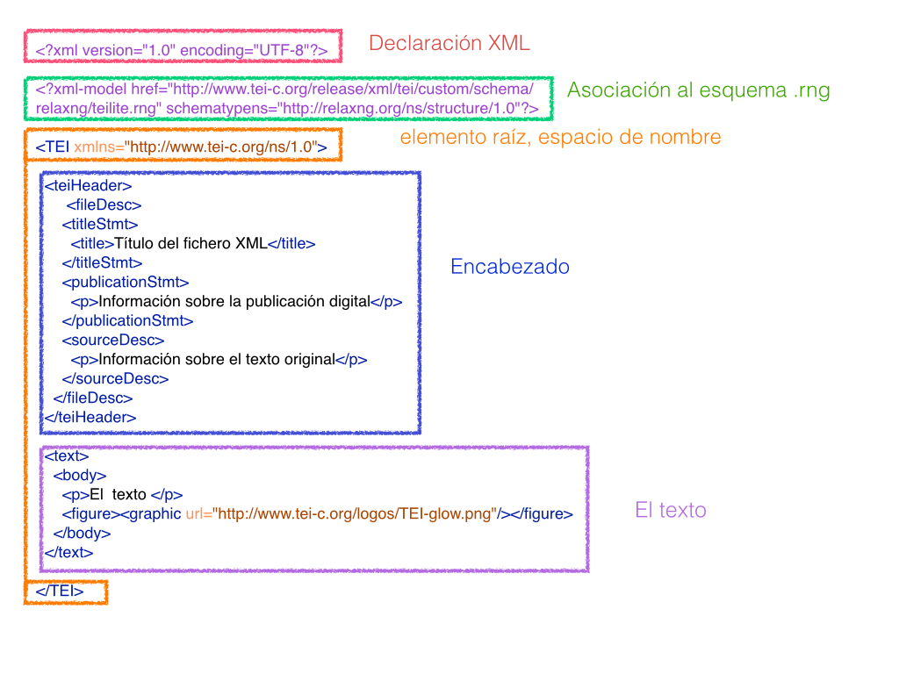

En esta lección nos centraremos en la estructura básica de los documentos XML-TEI, viendo solo aquellos elementos obligatorios para empezar a trabajar con un documento TEI válido y bien formado.

# 1. Nociones básicas sobre XML-TEI
 
Recapitulando algunas nociones básicas, recordaremos los siguientes puntos:
 
* TEI es un marco de trabajo basado en el lenguaje de marcado XML que define una serie de *Guías directrices* y recomendaciones para marcar electrónicamente textos de cualquier disciplina y de cualquier época.
* Al ser XML, TEI es a su vez independiente de cualquier programa y plataforma.
* El objetivo final es el de organizar y estructurar los textos electrónicamente de manera que puedan ser procesados y explotados por las computadoras.
* El tipo de marcado utilizado puede ser personalizado según las necesidades de cada texto o cada proyecto.
 
En la lección anterior, explicamos los mecanismos que rigen el lenguaje XML, y ahora, debemos empezar a trabajar con las etiquetas propias del sistema TEI. Pero recuerda: un documento TEI es también XML, de manera que sus elementos siguen la misma sintaxis.

La estructura mínima de un documento XML-TEI se compone básicamente de los siguientes elementos:
 
* **Prólogo XML** que comprende todo lo que va desde el principio del documento hasta el elemento raíz, e incluye normalmente la declaración XML y cualquier instrucción de procesamiento como la asociación de un esquema.
* **Elemento raíz**, en este caso `TEI`
* **Encabezado**, `teiHeader`
* **Cuerpo del texto**, `text`y `body`
 

 
A continuación desarrollaremos cada una de estas partes. Para seguir esta lección te sugerimos que abras en VS Code el archivo [ejemplo_tei_1.xml](enlace) y que busques en el archivo las diferentes partes del documento a las que se refiere cada sección de esta lección. 
 
# 2. Prólogo XML

En el prólogo del documento XML-TEI encontramos los elementos típicos de un XML:

En la primera línea aparece la  **declaración XML**:
 
```xml
<?xml version="1.0" encoding="UTF-8"?>
```
 
Como ya vimos en la lección anterior, la declaración XML nos indica que se trata de un documento XML y que el tipo de codificación utilizado es el [UTF-8](https://es.wikipedia.org/wiki/UTF-8).

En la siguiente línea encontramos la **declaración del modelo de XML**. Aquí estamos asociando nuestro documento a un esquema RelaxNG, que define el conjunto de reglas va a tener que seguir para ser válido (por ejemplo, qué elementos son obligatorios y cuáles optativos, en dónde pueden aparecer cada uno de esos elementos, o qué atributos pueden agregarse en cada uno):

```xml
<?xml-model href="ejemplo_esquema.rng" type="application/xml" schematypens="http://relaxng.org/ns/structure/1.0"?>
```
Gracias a esta indicación sabemos que este documento XML depende de un esquema que fija la estructura básica del marcado TEI que utilizaremos (recordemos que este esquema puede cambiar y personalizarse de acuerdo al tipo de marcado que deseemos realizar). En este caso se utiliza el formato RelaxNG (.rng) para definir el esquema, ya que, aunque existen otras posibilidades como DTD y W3C, RelaxNG es la más utilizada y recomendada para TEI. 

Las posibilidades de personalización que ofrece el marcado TEI se relacionan directamente con su naturaleza modular. La TEI agrupa en un mismo “módulo” a un grupo de elementos pensados para el marcado de una tipología o fenómeno textual (como pueden ser poesía, drama, descripción de manuscritos, diccionarios, etc.). 

La forma en que se seleccionan los módulos que utilizaremos en nuestro marcado es a través de la construcción de un esquema RelaxNG. Más adelante (Lección 8) veremos en detalle los pasos necesarios para construir nuestros propios esquemas; por el momento es importante que tengas el [esquema de ejemplo](enlace) en la misma carpeta que el [ejemplo TEI](enlace) sobre el que estamos trabajando, para que estos dos archivos interactúen y VSCode pueda indicarnos si nuestro documento TEI es válido.
 
# 3. Elemento raíz y espacio de nombre

Una vez finalizado el prólogo XML, encontramos el **elemento raíz** `<TEI>` que engloba la totalidad del documento. Todo documento XML tiene un solo elemento raíz que no depende de ningún otro elemento y que contiene a todos los otros.  En su interior encontramos dos secciones principales, el encabezado y el texto, con la siguiente estructura:

 ```xml
<TEI xmlns="http://www.tei-c.org/ns/1.0">
 
<teiheader>
[...]
</teiheader>
 
<text>
[...]
</text>
 
</tei>
```

El elemento `<TEI>` no solo cumple la función de ser el elemento raíz para el resto de nuestra estructura, sino que también funciona como **declaración del [espacio de nombre](https://www.w3schools.com/xml/xml_namespaces.asp)**. Los documentos XML pueden incluir elementos declarados en diferentes espacios de nombre. Por eso, la función de esta declaración es evitar la ambigüedad de los nombres de los elementos y los atributos que pertenecen a una aplicación concreta de XML. Por ejemplo, imaginemos que en un mismo documento se utilizan dos sistemas de marcado que poseen elementos con el mismo nombre (por ejemplo `<p>`, que se utiliza para marcar párrafos tanto en TEI como en HTML). Señalando el espacio de nombre dentro del cual cada uno de estos elementos debe ser interpretado se evitan errores y ambigüedades. 
 
# 4. Encabezado (teiHeader)
 
El documento XML-TEI consiste en dos grandes secciones: el encabezado que recibe el nombre de [`<teiHeader>`](https://www.tei-c.org/release/doc/tei-p5-doc/es/html/ref-teiHeader.html), y el del texto propiamente dicho, llamado [`<text>`](https://www.tei-c.org/release/doc/tei-p5-doc/es/html/ref-text.html).

Comenzaremos por el **encabezado**, en donde encontramos los **metadatos**, es decir, la información relativa al texto que estamos marcando y al proceso de codificación del texto digital. En la práctica de las Humanidades Digitales los metadatos son fundamentales para facilitar el intercambio y la integración de los datos entre investigadores, por lo que dotar a nuestros documentos XML-TEI de un buen encabezado resulta de gran importancia para asegurar la perdurabilidad y las posibilidades de reutilización de los textos digitales que generamos.

## fileDesc

El `<teiHeader>` tiene un solo elemento obligatorio, llamado `<fileDesc>` (debemos recordar que TEI es sensible al uso de mayúsculas y minúsculas, por lo cual si escribiéramos `<teiheader>` o `<filedesc>`, el resultado no sería válido según nuestro esquema). Este elemento es el responsable de contener tanto la información sobre el fichero XML-TEI con el que estamos trabajando, como los detalles de la fuente primaria, y posee tres elementos obligatorios: `<titleStmt>`, `<publicationStmt>` y `<sourceDesc>`:

```xml
<teiHeader>
    <fileDesc>
     
     <titleStmt>
                <title>Título del fichero XML</title>
          </titleStmt>
 
      <publicationStmt>
            <p>Información sobre la publicación digital</p>
      </publicationStmt>
      
       <sourceDesc>
            <p>Información sobre el texto original</p>
      </sourceDesc>
 
    </fileDesc>
</teiHeader>
```

## titleStmt 

[`<titleStmt>`](https://www.tei-c.org/release/doc/tei-p5-doc/es/html/ref-titleStmt.html) contiene la información sobre el título del texto, y debe contener obligatoriamente un elemento más específico llamado `<title>` en donde se coloca el título propiamente dicho. En este caso el título del archivo TEI es igual al de la obra original, pero nada impediría titularlo de una manera diferente, por ejemplo, “Edición digital de la Regenta (1900)”. 

Además del título, que es obligatorio, el elemento `<titleStmt>` puede contener información sobre los individuos responsables del texto, tanto en la autoría (`<author>`), como en la edición (`<editor>`) del mismo. Si vamos al [ejemplo TEI](https://github.com/tthub-repo/ejemplos/blob/master/L3_Ejemplo_novela.xml) encontraremos la siguiente declaración del `<titleStmt>`:

```xml
      <titleStmt>
        <title>La Regenta</title>
        <author>Leopoldo Alas (Clarín)</author>
      </titleStmt>
```

## publicationStmt 

[`<publicationStmt>`](https://www.tei-c.org/release/doc/tei-p5-doc/en/html/ref-publicationStmt.html) recoge la información sobre la publicación digital. En este segmento del encabezado podemos indicar la editorial o institución que respalda la publicación del texto digital (`<publisher>`), así como información adicional sobre el lugar de publicación (`<pubPlace>`), la fecha (`<date>`) o la licencia bajo la que está registrado (`<licence>`). En nuestro ejemplo, la publicación digital fue realizada por la Biblioteca Virtual Miguel de Cervantes en Alicante, en el año 2000, por lo que el `<publicationStmt>` tiene la siguiente forma:

```xml
<publicationStmt>
<publisher>Biblioteca Virtual Miguel de Cervantes</publisher>
<pubPlace>Alicante</pubPlace>
<date>2000</date>
</publicationStmt>
```

Por otra parte, si el texto digital en el que estamos trabajando no se encuentra publicado oficialmente, pero deseamos protegerlo con una licencia, podemos incluir una propia. En la mayoría de los casos, las licencias utilizadas son del tipo [Creative Commons](https://creativecommons.org/), y la recomendación actual para proyectos de Humanidades Digitales es la variante [CC BY SA](https://creativecommons.org/licenses/by-sa/4.0/), que permite que el material pueda reutilizarse siempre que se dé el crédito adecuado a sus creadores y se indique si se realizó alguna modificación sobre el original. Esta información se puede agregar como un párrafo (`<p>`) en el interior del elemento `<publicationStmt>`, como veremos en el ejemplo que se encuentra más abajo. Si este es el caso, es conveniente también agregar una referencia a la licencia que estamos utilizando; para ello utilizaremos el elemento `<ref>` con el atributo `@target`, que nos permitirá indicar la URL de la licencia.

```xml
   <publicationStmt>
    <p>
<ref target="https://creativecommons.org/licenses/by-sa/4.0/">
Este texto se publica con licencia de uso abierto Creative Commons</ref>
    </p>
   </publicationStmt>
```

## sourceDesc

[`<sourceDesc>`](https://www.tei-c.org/release/doc/tei-p5-doc/en/html/ref-sourceDesc.html) contiene la información sobre la o las fuentes primarias utilizadas. Dependiendo de la naturaleza de las fuentes (por ejemplo, si se trata de una fuente impresa o manuscrita, si es una obra singular o un corpus, etc.), TEI ofrece varios elementos que pueden anidarse en `<sourceDesc>`. En el caso de tener una referencia bibliográfica, el elemento que nos será de mayor utilidad es `<bibl>`, que a su vez incluirá los elementos en los que agregaremos la información deseada. Al igual que en el `<publicationStmt>` se pueden incluir los elementos `<date>`, `<pubPlace>` y `<publisher>` (entre otros), pero es importante distinguir que en este caso la información se refiere a la fuente original del texto, mientras que en el elemento anterior la información es relativa a la publicación digital. Podríamos, además, enriquecer las informaciones con la localización de la obra original, la división en tomos o cualquier otro dato que consideremos pertinentes.
    
 ```xml
  <sourceDesc>
     <bibl>
  <publisher>Librería de Fernando Fé</publisher>
  <pubPlace>Madrid</pubPlace>
  <date>1900</date>
     </bibl>
  </sourceDesc>
```
 
Otra forma de declarar la información sobre la fuente en el elemento `<sourceDesc>` es incluirla en un elemento `<p>`, como podemos observar en el siguiente ejemplo:


 ```xml
      <sourceDesc>
        <p>La Regenta, por Leopoldo Alas (Clarín). Madrid, Librería de Fernando Fé 1900</p>
      </sourceDesc>
```

## Otros elementos

En esta lección nos centramos en `<fileDesc>`, que como ya mencionamos, se trata del único elemento obligatorio del `<teiHeader>`; sin embargo, el encabezado de TEI admite también otros elementos optativos en los que no ahondaremos, pero que mencionaremos brevemente:

* [`<encodingDesc>`](https://www.tei-c.org/release/doc/tei-p5-doc/en/html/ref-encodingDesc.html) contiene información sobre la propia codificación TEI. 
* [`<profileDesc>`](https://tei-c.org/release/doc/tei-p5-doc/en/html/ref-profileDesc.html) proporciona información contextual sobre el perfil del texto.
* [`<revisionDesc>`](https://tei-c.org/release/doc/tei-p5-doc/en/html/ref-revisionDesc.html) permite llevar un registro de los cambios realizados sobre el texto digital.
 
Si quieres seguir profundizando en las opciones de codificación que ofrece el encabezado de TEI, en las [*Guías directrices*](https://tei-c.org/guidelines/P5/) se puede encontrar toda la documentación relativa al [`teiHeader`](https://www.tei-c.org/release/doc/tei-p5-doc/en/html/ref-teiHeader.html), así como múltiples ejemplos.
 
# 5. Cuerpo del documento
 
El cuerpo del documento corresponde al elemento `<text>` que puede contener, a su vez, tres (sub)elementos:
 
* [`<front>`](https://www.tei-c.org/release/doc/tei-p5-doc/en/html/ref-front.html) se utiliza para marcar secciones paratextuales que preceden el texto, tales como prefacios, prólogos, cartas dedicatorias, una lista de personajes, etc. y no es obligatorio (en el [ejemplo TEI 1](enlace) se puede observar que este elemento se utiliza para marcar el prólogo de la novela.
* [`<body>`](https://www.tei-c.org/release/doc/tei-p5-doc/en/html/ref-body.html) se consagra al texto propiamente dicho del documento y es obligatorio.
* [`<back>`](https://www.tei-c.org/release/doc/tei-p5-doc/en/html/ref-back.html) puede utilizarse para añadir los apéndices, índices, cronologías, bibliografías, etc. No es obligatorio.
 
## Divisiones `div`
 
Uno de los elementos más utilizados en el cuerpo del documento es el de “división”, [`<div>`](https://www.tei-c.org/release/doc/tei-p5-doc/en/html/ref-div.html), que es utilizado para marcar cualquier tipo de sección estructural del texto, como tomos o volúmenes, libros, capítulos, partes, apartados, etc.
 
<span style="color:red">En nuestro ejemplo</span> <!--Aquí habéis suprimido el ejemplo de text front divs tomos etc., y creo que no se sabe bien a qué hace referencia --> se puede observar cómo hemos utilizado el elemento `<div>` para:

* caracterizar el “prólogo”.
* diferenciar los diferentes “tomos”.
* estructurar los diferentes “capítulos”.
 
Al afrontar cualquier estructuración de un texto, es pues un buen ejercicio empezar identificando las diferentes secciones del texto con `<div>` diferentes. Normalmente, cada una de las `<div>` tiene un atributo `@type` que ayuda a caracterizar esa sección en particular. El valor que puede conllevar `@type` es libre, con lo cual podemos utilizar el que mejor nos convenga (ej. libro, capítulo, escena, acto, poema, estrofa, etc.) y en la lengua que queramos.
 
Otro atributo muy utilizado es el `@xml:id` que asigna un identificador único a una sección particular del texto. Este mecanismo es imprescindible en el caso de que queramos aislar determinadas porciones del texto. Por ejemplo, con este mecanismo al buscar una palabra podremos recuperar fácilmente en qué sección del libro estaba. El `@xml:id` se puede utilizar en una gran variedad de elementos, como bien podéis imaginar es realmente útil en los casos de capítulos, líneas, versos, páginas, etc. Además, identificando las secciones de esta manera facilitamos el que otras partes del documento apunten a esa sección en concreto; de hecho, para la creación de “links”, este es un requisito indispensable: para crear un enlace necesitamos decirle al ordenador que vaya de un punto hacia otro, es decir, de un punto hacia un identificador concreto. Un elemento `<div>` con los atributos mencionados tendría esta forma:
 
```xml
<div type="tomo" xml:id="tomo_1" > ...</div>
```
 
El texto o la masa textual se incluye siempre en el interior de elementos más concretos; no podemos añadir texto directamente dentro del elemento `<div>`. Por eso, en el caso que tengamos párrafos, utilizaremos el elemento `<p>`, en el caso que tuviéramos otros fragmentos de texto que no fueran párrafos, se podrían utilizar otros elementos más genéricos, como `<ab>` (*anonymous block*), que indica cualquier unidad textual sin una semántica concreta (como es el caso, por ejemplo de “párrafo”, o “frase”).
 
## Títulos y otros contenidos preliminares

Además de divisiones y párrafos, el elemento `<body>` puede incluir contenidos preliminares, como titulares, epígrafes, rúbricas, etc., que como editores consideramos que deben ser incluidos como parte del texto; el elemento que utilizamos con ese objetivo es `<head>`:

```xml
<head>Capítulo 1</head>
```
 
## Párrafos
 
El párrafo es la unidad más pequeña en la que un texto en prosa puede dividirse. El elemento utilizado para marcar los párrafos es `<p>`.
 
```xml
<p> Aquella tarde hablaron la Regenta y el Magistral en el paseo. El Arcipreste procuró que se encontraran y por su confianza con la Regenta facilitó la entrevista. </p>
<p> Pocas veces habían cruzado la palabra la hermosa dama y el Provisor, y nunca había pasado la conversación de los lugares comunes a que obliga el trato social.</p>
```
 
En los casos, por ejemplo, que quisiéramos dividir ulteriormente un párrafo, podríamos utilizar otros elementos como [`<s>`](https://www.tei-c.org/release/doc/tei-p5-doc/en/html/ref-s.html) (*segment*) para dividir otro tipo de segmentos, como por ejemplo, las oraciones:
 
```xml
<p><s type=”oracion”>Aquella tarde hablaron la Regenta y el Magistral en el paseo.</s><s type=”oracion”>El Arcipreste procuró que se encontraran y por su confianza con la Regenta facilitó la entrevista.</s></p>
```
El elemento `<p>` puede contener una gran variedad de atributos (por ejemplo, `type` o `xml:id`) y elementos en su interior, prácticamente todos los que veremos en la próxima lección de este tutorial.
 
Los elementos con los que trabajamos en esta unidad son los obligatorios para obtener un documento TEI válido a partir de un texto en prosa, sin embargo, distan mucho de agotar todas las posibilidades de marcado que el estándar de TEI nos ofrece. En la próxima unidad seguiremos profundizando en estas posibilidades.
 
# 6. Práctica: Creación de un documento XML-TEI válido y bien formado
 
Para aplicar de forma práctica los contenidos de esta lección crearemos un documento XML-TEI bien formado y válido desde cero. Con este fin, te recomendamos seguir los siguientes pasos en orden:
 
## Paso 1

Incluir la declaración XML y la asociación al esquema. Puedes copiar el prólogo XML tal cual como aparece en el ejemplo TEI de esta lección, pero recuerda que, para que funcione la validación, el archivo ejemplo_esquema.rng debe estar guardado en la misma carpeta que el archivo XML en el que estamos trabajando. 
 
## Paso 2

Crear un elemento raíz que contenga al resto del documento (en nuestro caso, al estar trabajando con TEI, ese será el elemento `<TEI xmlns="http://www.tei-c.org/ns/1.0">`. No olvides crear la etiqueta de cierre `</TEI>` al final.
 
## Paso 3

Crear el `<teiHeader>` de nuestro archivo, con su `<filesDesc>` que contenga `<titleStmt>`, `<publisherStmt>` y `<sourceDesc>`. 
 
La información del archivo que debes codificar es la siguiente:
 
El texto que marcaremos pertenece al cuento *Casa tomada*, de Julio Cortazar. En este caso no realizaremos una publicación digital, así que nos limitaremos a incluir un párrafo indicando que el documento se publicará bajo una licencia Creative Commons (ver el segundo ejemplo de `<publisherStmt>` que se ofrece más arriba en la lección). Finalmente la fuente del texto es el libro *Bestiario*, publicado en 1951 por la Editorial Sudamericana.
 
## Paso 4

Crear el `<text>`. En este caso no trabajaremos con un prólogo, así que pasaremos directamente al elemento `<body>`, dentro del cual solo incluiremos y marcaremos los dos primeros párrafos del cuento:
 
```
Nos gustaba la casa porque aparte de espaciosa y antigua (hoy que las casas antiguas sucumben a la más ventajosa liquidación de sus materiales) guardaba los recuerdos de nuestros bisabuelos, el abuelo paterno, nuestros padres y toda la infancia.
Nos habituamos Irene y yo a persistir solos en ella, lo que era una locura pues en esa casa podían vivir ocho personas sin estorbarse. Hacíamos la limpieza por la mañana, levantándonos a las siete, y a eso de las once yo le dejaba a Irene las últimas habitaciones por repasar y me iba a la cocina. Almorzábamos al mediodía, siempre puntuales; ya no quedaba nada por hacer fuera de unos platos sucios. Nos resultaba grato almorzar pensando en la casa profunda y silenciosa y cómo nos bastábamos para mantenerla limpia. A veces llegábamos a creer que era ella la que no nos dejó casarnos. Irene rechazó dos pretendientes sin mayor motivo, a mí se me murió María Esther antes que llegáramos a comprometernos. Entramos en los cuarenta años con la inexpresada idea de que el nuestro, simple y silencioso matrimonio de hermanos, era necesaria clausura de la genealogía asentada por nuestros bisabuelos en nuestra casa. Nos moriríamos allí algún día, vagos y esquivos primos se quedarían con la casa y la echarían al suelo para enriquecerse con el terreno y los ladrillos; o mejor, nosotros mismos la voltearíamos justicieramente antes de que fuese demasiado tarde.
```

## Paso 5
 
 Comprobar que el documento resultante sea válido y esté bien formado. 