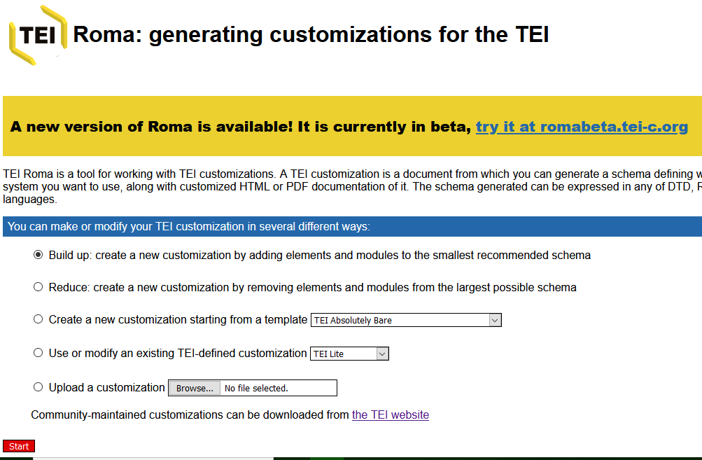
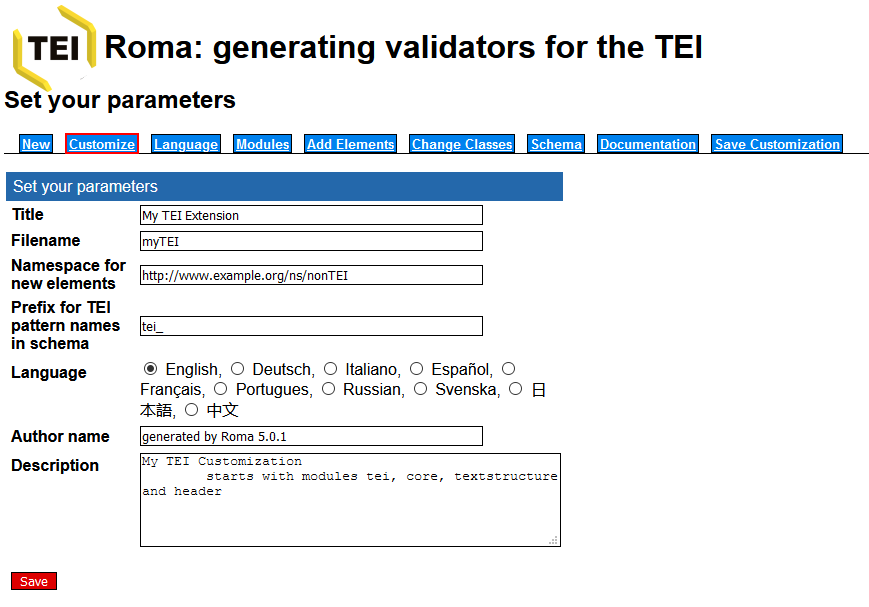
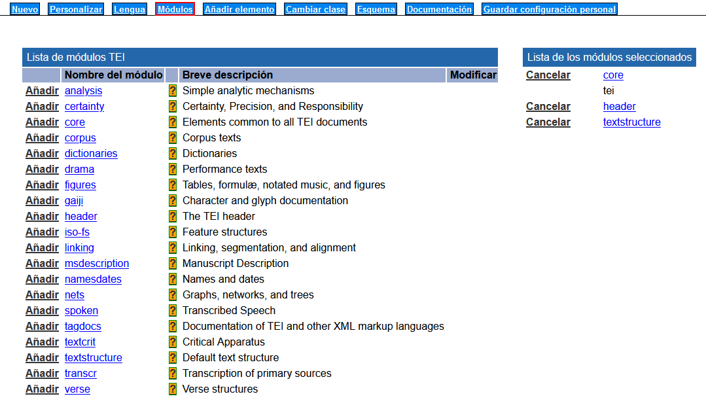
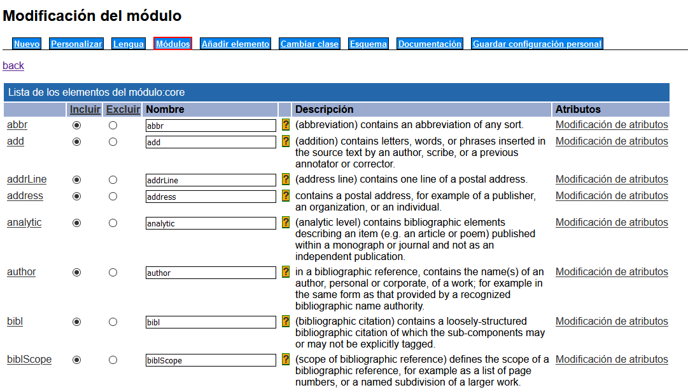
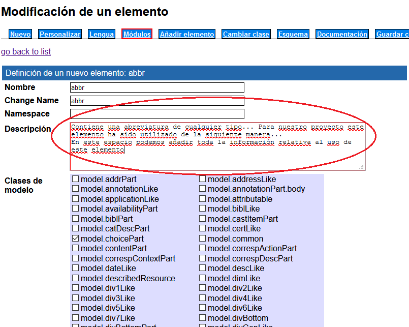
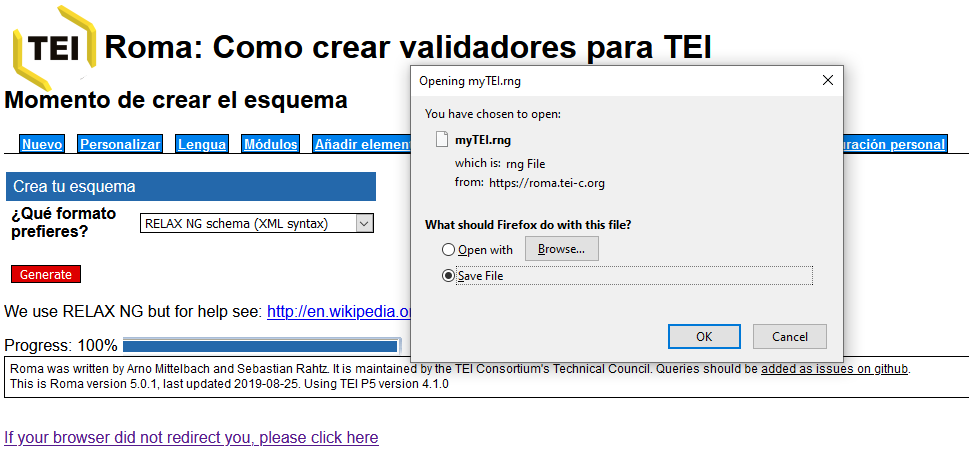

 
En esta lección veremos con un poco de detalle qué son los esquemas y cómo llevar a cabo la personalización de un documento TEI a través de estos. Para ello, presentaremos de manera general la función del esquema en los proyectos de edición digital en TEI, centrándonos en el lenguaje Relax NG, y en la aplicación online [**Roma**](https://roma.tei-c.org/), que facilita la personalización de los esquemas que acompañan los documentos XML-TEI.
 
# 1. Principios fundamentales del esquema
 
Para trabajar con un documento XML y aplicar un tipo concreto de marcado debemos tener un modelo de trabajo, una especie de guía que nos indique de qué modo debemos proceder para codificar ese texto, de manera que si interviene más de una persona, todas lleven a cabo un marcado homogéneo.
 
Para ello, necesitamos asociar nuestro documento XML con un esquema que sirva justamente para establecer el tipo de marcado que podemos aplicar a un documento XML. Los esquemas son archivos autónomos que se asocian al documento XML-TEI en su prólogo. La comunidad TEI ofrece algunos esquemas ya construidos a los que podemos asociar nuestro documento. Por ejemplo, si quisiéramos asociar nuestro documento a un esquema general que llaman `tei all` lo haríamos de la siguiente manera:
 
```xml
<?xml version="1.0" encoding="UTF-8"?>
<?xml-model href="http://www.tei-c.org/release/xml/tei/custom/schema/relaxng/tei_all.rng" type="application/xml" schematypens="http://relaxng.org/ns/structure/1.0"?>
<TEI xmlns="http://www.tei-c.org/ns/1.0">
…
</TEI>
```
 
Si, en cambio, quisiéramos asociar nuestro documento a un esquema que nosotros mismos hemos creado, deberíamos indicarlo a través de una URL (dentro del elemento `@href`), apuntando a la ubicación en local o en línea:
 
```xml
<?xml-model href="/esquema/nuestro_esquema.rng" schematypens="http://relaxng.org/ns/structure/1.0"?>
<TEI xmlns="http://www.tei-c.org/ns/1.0">
…
</TEI>
```
En este caso, como puede verse, el esquema estaría en una carpeta llamada "esquema" al mismo nivel que el documento XML-TEI.
 
Los esquemas, como se explica brevemente en la [lección 3](enlace), son los responsables de la validación de nuestro documento. Recuerda que una cuestión es el estar bien formado, según las normas del lenguaje XML, y la otra ser válido, según las normas de un esquema.
 
 
Un esquema establece la representación formal de los elementos y atributos cuyo uso se permitirá en el documento a codificar. Así, por ejemplo, establece cuál será el elemento raíz del documento, los nombres de los elementos utilizados, los nombres y los tipos de datos (cadena de caracteres, números, etc.), las reglas sobre cómo los elementos deben anidarse, e incluso, a veces, los valores por defecto de los atributos. Un esquema, pues, especifica la estructura y la nomenclatura de nuestro fichero; la semántica de los elementos, por otro lado, queda como siempre relegada a las *Guías directrices* TEI.
 
La comunidad TEI ofrece algunos esquemas ya construidos a los que podemos asociar nuestro documento, como puede ser la versión mínima, llamada TEI Lite, que contiene una selección reducida de los elementos de uso más común. Sin embargo, estas opciones tienen sus limitaciones. En muchos casos vamos a querer incluir elementos específicos para los fenómenos que deseamos marcar en nuestros textos que no se encuentran en la versión mínima, o incluso puede darse una situación en la que necesitemos crear nuestros propios elementos o agregar atributos a los elementos existentes. Con este fin, el consorcio TEI pone a nuestra disposición una plataforma en línea, llamada [Roma](https://roma.tei-c.org/), para la creación de esquemas personalizados.
 
# 2. Aplicación Roma

En este apartado vamos a ver cómo funciona [**Roma**](https://roma.tei-c.org/) y cómo construir un esquema Relax NG a nuestra medida y guardar las opciones de nuestra personalización como un documento ODD [*One Document Does it all*](https://wiki.tei-c.org/index.php/ODD), un archivo XML-TEI a partir del cual podremos generar el esquema en diferentes lenguajes y recuperar la documentación de nuestro proyecto. Comencemos nuestro recorrido en la página de portada de la aplicación:



En la captura de pantalla podemos ver la interfaz de inicio de la plataforma Roma, donde aparece un enlace a la nueva plataforma en la que se está trabajando actualmente, *Roma-ODD Customization*. Sin embargo, esta nueva plataforma se encuentra aún en una versión beta, por lo que utilizaremos la versión tradicional de Roma. Las opciones disponibles en esta primera pantalla son las siguientes:

* *Build up*: Construir un modelo personalizado a partir de una versión mínima con sólo los cuatro módulos obligatorios. El proceso consiste en añadir módulos y personalizar los elementos y atributos.
* *Reduce*: Construir un modelo personalizado a partir de una versión máxima con todos los módulos TEI. El proceso consiste en eliminar módulos y elementos y atributos.
* *Create a new customization starting from a template*: Crear un modelo a partir de una de las plantillas propuestas por TEI.
* *Use or modify an existing TEI-defined customization*: Crear un modelo a partir de la modificación del modelo TEI Lite.
* *Upload a customization*: Sección para subir a la plataforma un modelo ya existente en forma de documento ODD. Al final la personalización, la guardaremos con este formato, esto significa que si desearas seguir trabajando en ella en un momento posterior, podrías cargar el archivo ODD en Roma usando esta opción y realizar las modificaciones que sean necesarias.

Para comenzar, elegiremos la primera opción *Build up*, es decir, crearemos un esquema a partir de una versión mínima que sólo contiene los módulos obligatorios. Al seleccionar esta opción se nos abrirá la siguiente pantalla, que corresponde a los metadatos del esquema:



En esta pantalla se puede cambiar las informaciones por defecto por las nuestras y seleccionar como lengua de la interfaz el “Español”. A continuación, podemos guardar el esquema, haciendo clic en el botón rojo (Save). Al guardar el esquema, se aplicará el cambio de lengua de la plataforma; a partir de este punto nos referiremos a las pestañas y opciones por su nombre en la interfaz en español. 
En las pestañas que aparecen en la parte superior de la pantalla veremos las diferentes secciones que la plataforma Roma nos ofrece para la creación de nuestro esquema. Veamos las primeras cuatro:

* **Nuevo**: Retrocede a la pantalla de inicio.
* **Personalizar**: Corresponde a la pantalla donde hemos creado el título y los otros metadatos del esquema.
* **Lengua**: En este apartado tenemos la posibilidad de elegir entre diferentes lenguas, esto nos proporcionará una documentación de los elementos en la lengua escogida (siempre que exista una traducción). En nuestro caso, podemos escoger “Español”, aunque las Guías directrices no ofrecen todas las traducciones de los elementos y secciones. La más actualizada y completa es la versión en inglés.
* **Módulos**: Esta es una de las pantallas más importantes, pues es aquí donde elegiremos qué módulos vamos a incluir en nuestro esquema. 

Alcaraz Martínez y Vázquez Puig (2016) nos ofrecen una versión en castellano de la descripción de los módulos que proporciona TEI:

* [analysis](https://roma.tei-c.org/startroma.php?mode=changeModule&module=analysis): pensado para asociar análisis simples e interpretaciones a elementos textuales. Por ejemplo, para indicar el predicado de una frase, el prefijo o sufijo de una palabra, o su categoría gramatical.
* [certainty](https://roma.tei-c.org/startroma.php?mode=changeModule&module=certainty): permite indicar que aspectos concretos del texto son problemáticos o inciertos. Esto se manifiesta en forma de notas o de aclaraciones en el texto.
* [core](https://roma.tei-c.org/startroma.php?mode=changeModule&module=core): se trata de un conjunto de elementos básicos disponibles para la codificación de cualquier tipo de texto como, por ejemplo, párrafos, listas, texto enfatizado, referencias bibliográficas, etc.
* [corpus](https://roma.tei-c.org/startroma.php?mode=changeModule&module=corpus): pensado para crear corpus lingüísticos.
* [dictionaries](https://roma.tei-c.org/startroma.php?mode=changeModule&module=dictionaries): en él encontramos los elementos necesarios para codificar cualquier tipo de recurso léxico como, por ejemplo, diccionarios o glosarios.
* [drama](https://roma.tei-c.org/startroma.php?mode=changeModule&module=drama): diseñado para codificar obras teatrales, guiones cinematográficos o radiofónicos, entre otros.
* [figures](https://roma.tei-c.org/startroma.php?mode=changeModule&module=figures): orientado a describir gráficos, tablas, imágenes, obras de arte, fórmulas matemáticas, etc., que forman parte de los documentos.
* [gaiji](https://roma.tei-c.org/startroma.php?mode=changeModule&module=gaiji): para codificar glifos y otros caracteres especiales, tipos de escrituras (vertical, horizontal, de derecha a izquierda, etc.), etc.
* [header](https://roma.tei-c.org/startroma.php?mode=changeModule&module=header): proporciona metadatos descriptivos sobre el recurso codificado (información bibliográfica, menciones de responsabilidad, información sobre el proyecto e investigadores y centros participantes, información de aspectos no bibliográficos como, por ejemplo, materias o códigos de clasificación, el historial de revisión de la codificación, etc.).
* [iso-fs](https://roma.tei-c.org/startroma.php?mode=changeModule&module=iso-fs): permite representar las interrelaciones entre piezas de información, proporcionando su instanciación en el marcado, un metalenguaje para representaciones genéricas de los análisis e interpretaciones realizados.
* [linking](https://roma.tei-c.org/startroma.php?mode=changeModule&module=linking): ofrece diferentes elementos que permiten representar relaciones entre partes de los documentos a partir de identificadores y enlaces.
* [msdescription](https://roma.tei-c.org/startroma.php?mode=changeModule&module=msdescription): define elementos pensados para proporcionar información descriptiva detallada sobre cualquier tipo de texto manuscrito. Inicialmente, fue concebido para satisfacer las necesidades de los catalogadores y académicos que trabajaban con manuscritos medievales de tradición europea, aunque actualmente se puede extender su uso a otras tradiciones y materiales.
* [namesdates](https://roma.tei-c.org/startroma.php?mode=changeModule&module=namesdates): un módulo pensado para codificar fechas, nombres y otros identificadores de personas, lugares y organizaciones.
* [nets](https://roma.tei-c.org/startroma.php?mode=changeModule&module=nets): permite codificar representaciones gráficas utilizadas para visualizar las relaciones que se establecen entre unidades de información. Se prevé el uso de grafos y mapas conceptuales.
* [spoken](https://roma.tei-c.org/startroma.php?mode=changeModule&module=spoken): orientado a describir transcripciones de cualquier tipo de discurso oral.
* [tagdocs](https://roma.tei-c.org/startroma.php?mode=changeModule&module=tagdocs): ofrece un conjunto de elementos que pueden ser utilizados para documentar los elementos XML. Muy pensado para los proyectos en los cuales se personaliza o modifica el núcleo o alguno de los módulos del estándar.
* **tei**: contiene las declaraciones de todos los tipos de datos y las declaraciones iniciales de las clases de atributos, modelos y las macros utilizadas por el resto de módulos del esquema.
* [textcrit](https://roma.tei-c.org/startroma.php?mode=changeModule&module=textcrit): permite crear aparatos críticos propios de la crítica textual.
* [textstructure](https://roma.tei-c.org/startroma.php?mode=changeModule&module=textstructure): un módulo obligatorio que contiene la estructura de alto nivel por defecto de cualquier documento TEI.
* [transcr](https://roma.tei-c.org/startroma.php?mode=changeModule&module=transcr): pensado para representar fuentes primarias, como manuscritos, cartas o diarios.
* [verse](https://roma.tei-c.org/startroma.php?mode=changeModule&module=verse): diseñado para codificar textos escritos total o parcialmente en verso”.

A continuación veremos esta pantalla con más detalle:



Como puede verse en la captura de pantalla, en la columna de la izquierda aparecen todos los módulos de TEI, mientras que en la derecha encontramos los módulos que queremos incluir en nuestro esquema. En un principio tendremos solo los módulos obligatorios: *core*, *tei*, *header*, *textstructure*. A partir de aquí, debemos saber a qué módulos pertenecen los fenómenos textuales que queremos codificar. Por lo general, si trabajamos con textos teatrales, tendremos que incluir el módulo *drama*, si trabajamos con poesía el módulo *verse*, etc. 

Roma también nos permite acceder al interior de cada uno de los módulos y ver todos los elementos que contiene. Por ejemplo, si accedemos al módulo `textcrit`, observamos la lista completa:



Una vez estamos en la sección de los módulos, podemos “Excluir” aquellos elementos que no necesitemos para nuestra codificación. En lo que concierne al “Nombre” podemos cambiar `<abbr>` por `<abreviatura>`, por ejemplo; sin embargo conviene dejarlo tal y como está para no provocar confusiones con el sistema estándar TEI de nombres de elementos. También tenemos la posibilidad de modificar los atributos, manteniendo los que nos interesan y suprimiendo los que no necesitamos. Finalmente, si hacemos clic sobre el nombre del elemento podremos acceder a más opciones, para detallar la “Descripción” de ese elemento. Dicha descripción es la que aparecerá en el apartado correspondiente de la documentación. Por ejemplo, retomemos el elemento `<abbr>` e imaginemos que queremos encuadrarlo en nuestro proyecto, de manera que sea útil a las personas que elaborarán la codificación, o incluso, para nosotros mismos.



Una vez añadidos los diferentes módulos que nos interesan, los veremos en la columna de la derecha. A continuación veremos las funciones que ofrecen el resto de las pestañas de Roma:

* **Añadir elemento**: A continuación, pasamos a la pestaña “Añadir elemento”, en el caso que queramos crear un nuevo elemento que no nos proporciona TEI; para ello, tendríamos que adjudicarle una clase de modelo y una clase de atributos. Esta práctica debe evitarse a no ser que sea estrictamente necesario, ya que al salirnos de los elementos proporcionados por las *Guías directrices*, nuestro archivo TEI pierde compatibilidad para su reutilización en otros proyectos de Humanidades Digitales.
* **Cambiar clase**: Lo mismo sucede con esta pestaña; podría darse el caso que un determinado elemento no tuviera los atributos que necesitamos, en tal caso, podríamos modificarlos y añadir otros nuevos en esta sección.
* **Esquema**: Esta sección permite escoger el tipo de esquema que queremos: DTD, W3C, RelaxNG, etc. Este es uno de los momentos claves, pues aquí es donde podremos obtener un esquema en el formato que deseemos. Las opciones que se nos ofrecen son las siguientes:

 * Relax NG schema (compact syntax) .rnc
 * Relax NG schema (XML syntax) .rng
 * ISO Schematron
 * Schematron
 * W3C Schema .xsd
 * DTD .dtd

Escogeremos la opción “Relax NG schema (XML syntax) .rng”, ya que este formato es compatible con la extensión *Scholarly XML*, y por lo tanto nos permitirá validar nuestros documentos TEI en VS Code.  Por último, pulsaremos “Generate” y se descargará el esquema que hemos elaborado:



* **Documentación**: Permite escoger que tipo de formato se prefiere para la documentación del esquema. Tenemos la posibilidad de bajarnos en un único documento la descripción de cada uno de los elementos y atributos elegidos en nuestro esquema según las *Guías directrices*. Los formatos de salida que podemos elegir son: “HTML web page”, “Word”, “TEI ODD”, “TEI Lite” o “LaTex”.
* Guardar configuración personal: La última pestaña de Roma nos da la opción de guardar nuestra personalización TEI como un documento ODD en formato XML. No debemos confundir este archivo con el esquema Relax NG que generamos en la pestaña de esquema, ya que sus funciones son diferentes. El archivo Relax NG se asocia al documento TEI para validar el marcado, pero una vez que lo generamos no podemos seguir modificándolo en la aplicación Roma (lo que sí se puede hacer es abrir el archivo del esquema en un editor de código y modificar sus valores manualmente, pero esto requiere un buen dominio de la sintaxis de Relax NG). En cambio, el archivo XML que descargamos en esta pestaña puede volver a ser cargado en la aplicación Roma en la primera de sus pantallas y a partir de ahí introducir nuevas modificaciones para generar un nuevo esquema y documentación actualizada (de ahí el nombre “One Document Does it all” que se le da a estos archivos en la comunidad de TEI). Esta opción es de gran utilidad para el desarrollo de esquemas en proyectos de larga duración.

# 3. Declaración de modelo XML
 
Como ya explicamos en unidades anteriores la función de la declaración de modelo XML es asociar un esquema a nuestro documento TEI. Hasta ahora estuvimos usando el esquema “ejemplo_esquema.rng” que descargaste de la carpeta “materiales TEI” al comienzo del módulo. Sin embargo, ahora que hemos creado nuestro propio esquema tendremos que hacer una modificación en las declaraciones de modelo XML de nuestros documentos TEI para validarlos con el nuevo Relax NG. Para eso modificaremos el valor del atributo `@href`, que indica el nombre y la ubicación del archivo de esquema asociado al documento TEI:

```xml
<?xml-model href="miesquemaTEI.rng" 
schematypens="http://relaxng.org/ns/structure/1.0"?>
```

En este ejemplo, el archivo del esquema es “miesquemaTEI” (recuerden que en Roma pueden definir en la pestaña de personalización el nombre del archivo Relax NG que se generará), y está almacenado en la misma carpeta que el documento XML-TEI. En el caso de que el esquema se encuentre guardado en una carpeta diferente a la del archivo TEI (o incluso en una ubicación en línea), debemos proporcionar una indicación completa de la ubicación del archivo en el valor del atributo `@href` para que el VS Code pueda recuperar el esquema y validar nuestro documento, por ejemplo:

```xml
<?xml-model href="C:\Users\gaa20\OneDrive\Documentos\Humanidades_digitales\TutorialTEI\miesquemaTEI.rng" 
schematypens="http://relaxng.org/ns/structure/1.0"?>
```

 
# 4. Práctica: Creación de un esquema en RelaxNG en ROMA

El objetivo de este ejercicio es crear un esquema RelaxNG utilizando la herramienta ROMA y asociarlo a un documento TEI a través de la declaración del modelo XML. Con ese fin, te sugerimos seguir estos pasos:

**[Paso 1]** Ingresa a [ROMA](https://roma.tei-c.org/) y selecciona la opción "Build up".

**[Paso 2]** Completa los datos de la pestaña inicial, recuerda que si lo deseas puedes configurar el idioma de ROMA en español

**[Paso 3]** En la pestaña "módulos", añade los módulos "verse" y "drama" y añade una nueva descripción para el elemento `<rhyme>`.

**[Paso 4]** Descarga el esquema en formato Relax NG (XML Syntax)

**[Paso 5]** Descarga el archivo ODD con la personalización que creamos en este ejercicio

**[Paso 6]** Asocia el archivo Relax NG del esquema que creamos al documento TEI que creamos en el ejercicio de drama y asegúrate de que te permita comprobar la validez del documento,


